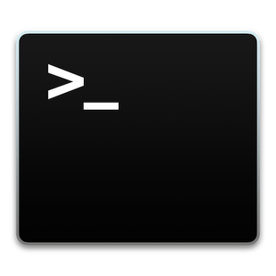

Beginner in bash/shell-script?

Below you find some help to commands that you will probaly need.

- MAN [en](content/en/man.md) [pt-br](content/pt-br/man.md)
- PWD [en](content/en/pwd.md) [pt-br](content/pt-br/pwd.md)
- WHOAMI [en](content/en/whoami.md) [pt-br](content/pt-br/whoami.md)
- PASSWD [en](content/en/passwd.md) [pt-br](content/pt-br/passwd.md)
- DATE [en](content/en/date.md) [pt-br](content/pt-br/date.md)
- CD [en](content/en/cd.md) [pt-br](content/pt-br/cd.md)
- LS [en](content/en/ls.md) [pt-br](content/pt-br/ls.md)
- MKDIR [en](content/en/mkdir.md) [pt-br](content/pt-br/mkdir.md)
- RMDIR [en](content/en/rmdir.md) [pt-br](content/pt-br/rmdir.md)
- CAT [en](content/en/cat.md) [pt-br](content/pt-br/cat.md)
- TAIL [en](content/en/tail.md) [pt-br](content/pt-br/tail.md)
- HEAD [en](content/en/head.md) [pt-br](content/pt-br/head.md)
- TOUCH [en](content/en/touch.md) [pt-br](content/pt-br/touch.md)
- CP [en](content/en/cp.md) [pt-br](content/pt-br/cp.md)
- MV [en](content/en/mv.md) [pt-br](content/pt-br/mv.md)
- RM [en](content/en/rm.md) [pt-br](content/pt-br/rm.md)
- UNLINK [en](content/en/unlink.md) [pt-br](content/pt-br/unlink.md)
- LN [en](content/en/ln.md) [pt-br](content/pt-br/ln.md)
- TRACEROUTE [en](content/en/traceroute.md) [pt-br](content/pt-br/traceroute.md)
- WHEREIS [en](content/en/whereis.md) [pt-br](content/pt-br/whereis.md)
- WHICH [en](content/en/which.md) [pt-br](content/pt-br/which.md)
- KILL [en](content/en/kill.md) [pt-br](content/pt-br/kill.md)
- SUDO [en](content/en/sudo.md) [pt-br](content/pt-br/sudo.md)
- CHOWN [en](content/en/chown.md) [pt-br](content/pt-br/chown.md)
- CHMOD [en](content/en/chmod.md) [pt-br](content/pt-br/chmod.md)
- FIND [en](content/en/find.md) [pt-br](content/pt-br/find.md)
- ECHO [en](content/en/echo.md) [pt-br](content/pt-br/echo.md)
